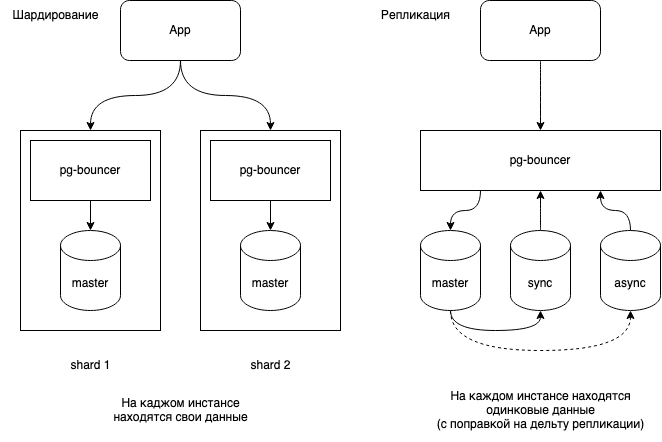

– разделение хранилища на несколько независимых частей.

Шардирование – это разновидность партиционирования. Только partition подразумевает разделение данных внутри одной базы, а шардирование распределяет их по разным экземплярам БД.

<mark style="background: #FFB86CA6;">Что дает:</mark>
- оптимизирует хранение данных – распределяет их между несколькими машинами, что улучшает отзывчивость сервиса, поскольку данных на каждом инстансе становится меньше

При шардировании необходимо обеспечить равномерную нагрузку, так как неравномерное распределение нагрузки на шарды снизит эффективность самого разделения. Например, нагрузка может быть только на одном инстансе и в этом случае остальные будут простаивать.

**Способы** шардирования:
- *средствами БД* – Mongo, ClickHouse, Elasticsearch умеют распределять данные между своими экземплярами, для этого достаточно настроить конфигурацию. 
- *надстройками к БД*
- клиентскими средствами – шардированием управляет стороннее приложение, инстанты БД ничего не знают друг про друга

Подходы:
- ***range*** – шардирование по диапазонам значений ключа – распределение Id по шардам (shard1: id 0 - 1000, shard2: id 1001 - 2000...)
- ***hash*** – шардирование по хэшу, при котором вычисляется хэш-функция каждого ключа и к каждой секции относится определенный диапазон хешей (нарушает упорядоченность ключей, делая запросы по диапазонам неэффективными, но позволяет более равномерно распределять нагрузку)
- ***mod*** – модульный. В данном случае каждая n-ая строка или каждый n-ый столбец отправляются в конкретный шард. Например, алгоритм MOD3 отправит в shard1 1, 4 и 7 строки, в shard2 - 2, 5 и 8 строки, в shard3 - 3, 6 и 9 и т.д.
- ***tag*** – отправляет в один шард все строки или столбцы, соответствующие конкретному значению (пример с распределением по странам `... where region="EU"`)

