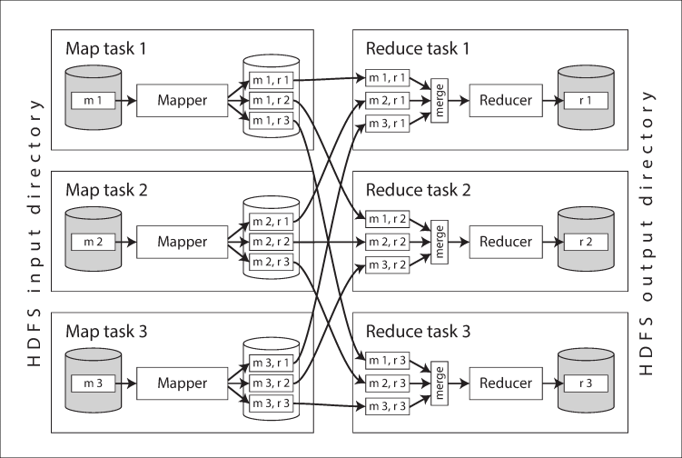

– система пакетной обработки данных, которая <mark style="background: #FFB86CA6;">позволяет обрабатывать большие объемы данных на кластерах компьютеров</mark>. Она состоит из двух основных компонентов: Map и Reduce. Разработана в Google.

>Идея заключается в том, чтобы разбить задачу на более мелкие подзадачи, распределить их по вычислительным узлам и затем собрать результаты.

### Map
- На этой стадии входные данные разбиваются на отдельные элементы, которые обрабатываются параллельно. Каждый элемент обрабатывается функцией Map, которая преобразует его в промежуточные ключи и значения.
#### Shuffle and Sort
- Промежуточные данные со всех узлов (результаты Map) передаются на следующую стадию. Эти данные сортируются по ключу, и все значения, соответствующие одному ключу, сгруппированы вместе. Это обеспечивает, что все экземпляры одинакового ключа обрабатываются в стадии Reduce.  
#### Reduce  
- Принимает ключи и сгруппированные значения и объединяет их.
  
##### Пример  
подсчет количества слов в документе:  
- **Map**: входной текст разделяется на слова, происходит формирование пар (слово, 1).  
- **Shuffle and Sort**: все пары сортируются по ключам (словам), и аналогичные ключи собираются вместе.  
- **Reduce**: для каждого слова суммируются значения (количества единиц), и результатом будет пара (слово, общее количество).  
  

### Преимущества MapReduce  
- задачи могут выполняться <mark style="background: #FFB86CA6;">параллельно</mark> на разных узлах, что значительно ускоряет обработку больших объемов данных.  
- система может <mark style="background: #FFB86CA6;">масштабироваться</mark> горизонтально, добавляя новые узлы.  
- <mark style="background: #FFB86CA6;">устойчивость</mark> к сбоям – если один из узлов выходит из строя, система может продолжить работу, перераспределяя задачи на оставшиеся узлы.
